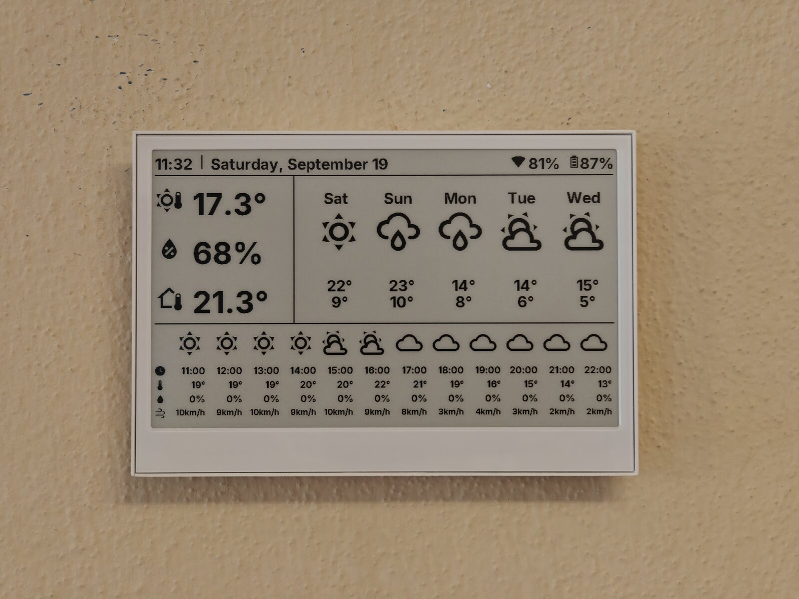

[](LICENSE)

# reTerminal E1001 Weather Display



Battery-powered ESPHome weather and clock dashboard for the Seeed reTerminal E1001 (7.5" mono e-paper), fed by Home Assistant over MQTT.

## Background

The reTerminal E1001 is a nice wall display, but the stock approach (ESPHome API, a full refresh every update) drains the battery and flashes the whole panel black and white every minute. This config keeps the clock ticking every minute while the ESP32-S3 spends almost all of its time in deep sleep: most wakes never touch Wi-Fi, redraw with a partial refresh, and go straight back to sleep.

## Features

- **Minute clock without Wi-Fi** — the on-board PCF8563 RTC seeds the system clock on every wake; SNTP corrects it every 6 hours
- **Network only every 10 minutes** — sync wakes connect to Wi-Fi and MQTT, read retained payloads, and redraw; the rest draw from values persisted in flash
- **Tiered e-paper refresh** — partial refresh on every wake, fast full refresh hourly, ghost-clearing full refresh every 6 hours
- **Retained MQTT instead of the native API** — no API reconnect backoff on wake; the display gets the latest values the moment it subscribes
- **Compact forecast payloads** — Home Assistant packs the 5-day and 12-hour forecast into two JSON messages, so the screen never paints half-populated
- **OTA-friendly deep sleep** — an OTA upload blocks sleep, and a Home Assistant toggle keeps the device awake on demand
- **Diagnostics** — room temperature/humidity (SHT40), battery, Wi-Fi signal, chip temperature and wake duration published to MQTT

## Quick Start

```bash
git clone https://github.com/fabianwimberger/reterminal-e1001-weather.git
cd reterminal-e1001-weather

python -m venv .venv
.venv/bin/pip install esphome

cp secrets.yaml.example secrets.yaml   # Wi-Fi, static IP, MQTT, OTA password
.venv/bin/esphome run reterminal-e1001.yaml   # first flash over USB
```

Home Assistant side:

```bash
cp homeassistant/reterminal.yaml /config/packages/reterminal.yaml
# replace every line marked "# CHANGE" with your entity IDs, then restart Home Assistant
```

This needs an MQTT broker (Home Assistant + the display both connect to it) and a weather entity with daily + hourly forecasts. The exact tested setup — Mosquitto with per-user ACLs, mean-group source entities, and every step in between — is written out in the [Setup Guide](SETUP.md).

Later updates go over the air. The device is only online for a few seconds on its 10-minute sync wake; either start the upload shortly before it wakes (the OTA start blocks deep sleep) or turn on `input_boolean.reterminal_prevent_sleep` first.

## How It Works

```
Home Assistant ──(retained MQTT, every minute)──► broker
                                                     │
reTerminal:  wake every 60 s
   ├─ 9 of 10 wakes:  RTC time + persisted data ──► partial refresh ──► deep sleep
   └─ every 10th:     Wi-Fi ► MQTT ► wait for payloads ──► refresh ──► deep sleep

refresh tier:  every 6 h  full (panel deep-sleeps, clears ghosting)
               hourly     fast full
               otherwise  partial
```

Partial refresh compares against the panel controller's previous-image RAM. The panel is kept out of its own deep sleep between wakes so that RAM survives; the 6-hourly full refresh deep-sleeps it, and the wake after that starts over with a fast full refresh.

This needs a small patch to ESPHome's `epaper_spi` component (seeding the update counter from the reset reason, plus `set_update_count()`), vendored in `external_components/` until it is merged upstream.

## Configuration

Substitutions at the top of `reterminal-e1001.yaml`:

| Variable | Default | Description |
|---|---|---|
| `name` | `reterminal-e1001` | ESPHome node name / hostname |
| `friendly_name` | `reTerminal E1001` | Display name in Home Assistant |
| `topic` | `home/reterminal` | MQTT topic prefix; must match `homeassistant/reterminal.yaml` |
| `sntp_server` | `pool.ntp.org` | NTP server used for the 6-hourly RTC correction |

Secrets (`secrets.yaml`):

| Variable | Description |
|---|---|
| `wifi_ssid`, `wifi_password` | Wi-Fi credentials |
| `static_ip`, `gateway`, `subnet`, `dns` | Static IP; skipping DHCP shortens every sync wake |
| `mqtt_broker`, `mqtt_username`, `mqtt_password` | MQTT broker Home Assistant publishes to |
| `ota_password` | OTA upload password |

Timings live in the config: `wake_count % 10` (sync interval), `% 60` / `% 360` (refresh tiers), and `deep_sleep.sleep_duration`. The time zone is taken from the machine that compiles the firmware; add `timezone:` to both `time:` platforms to override it. Date text comes from Home Assistant, so its language and format are set in the automation.

## License

MIT — see [LICENSE](LICENSE).

### Third-Party Licenses

| Component | License | Source |
|---|---|---|
| `external_components/epaper_spi` (patched ESPHome component) | GPLv3 (C++) / MIT (Python) | [esphome/esphome](https://github.com/esphome/esphome) |
| Material Design Icons webfont (downloaded at build time) | Apache 2.0 | [Templarian/MaterialDesign-Webfont](https://github.com/Templarian/MaterialDesign-Webfont) |
| Inter font (downloaded at build time) | SIL OFL 1.1 | [Google Fonts](https://fonts.google.com/specimen/Inter) |
